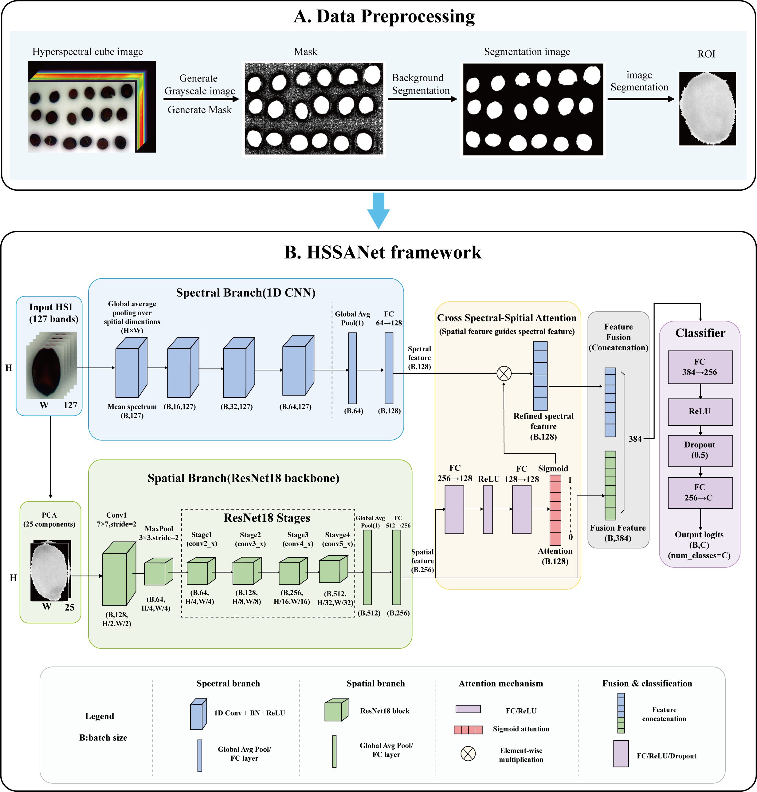
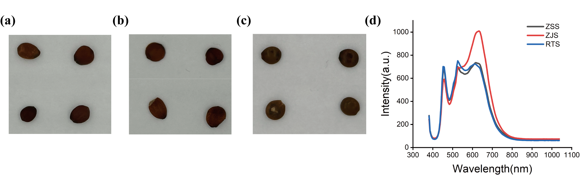
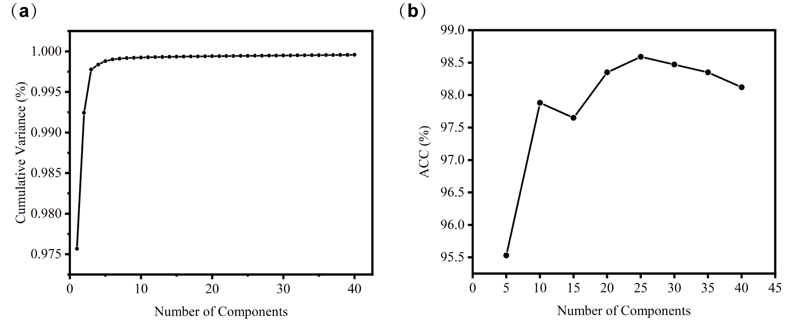
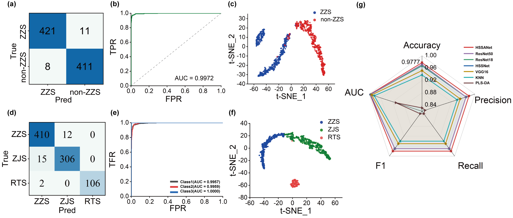
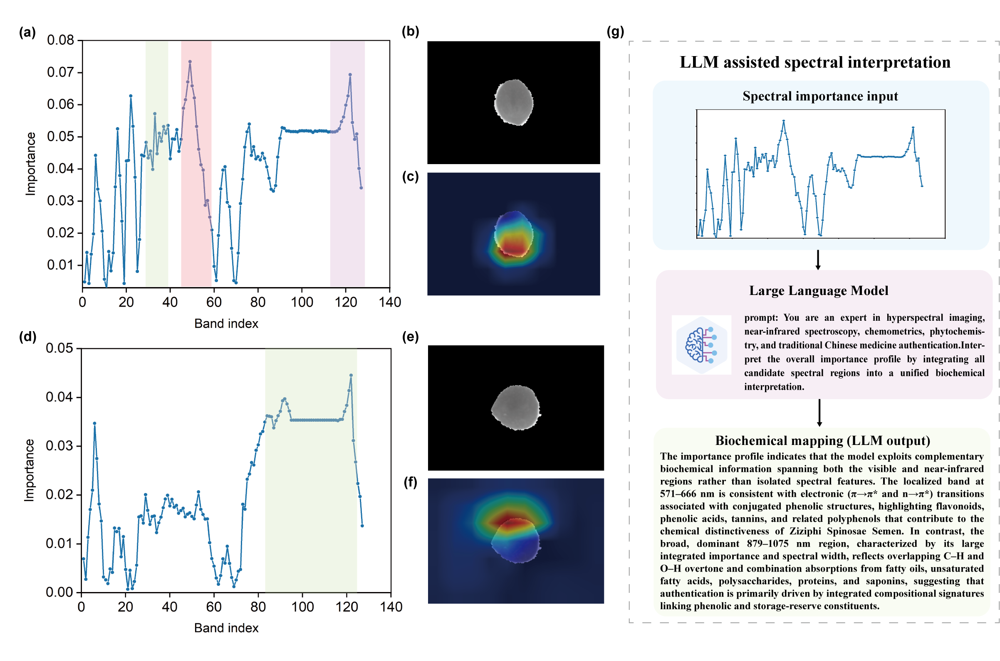
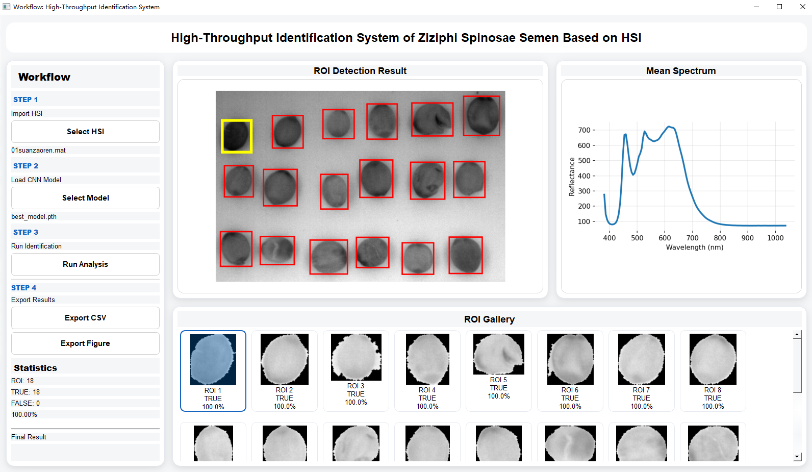

# Hyperspectral imaging coupled with a dual-branch spectral–spatial attention network for rapid and interpretable authentication of Ziziphi Spinosae Semen
## About
Hyperspectral imaging (HSI) offers rich spectral and spatial information for rapid and non-destructive authentication of food and medicinal materials. However, visually similar samples often exhibit subtle spectral differences, while conventional deep learning approaches may underutilize the complementary information embedded in hyperspectral data. Herein, we introduce HSSANet, a spectral–spatial attention network that integrates a 1D-CNN spectral branch with a ResNet18-based spatial branch to jointly capture discriminative spectral and spatial features for Ziziphi Spinosae Semen (ZSS) authentication. A cross spectral–spatial attention mechanism is further introduced to adaptively fuse complementary representations and enhance informative features. The framework achieves robust discrimination of ZSS and its adulterants while integrating model interpretability and a user-friendly graphical interface for practical hyperspectral analysis.

_______________

#### The flowchart of this work

_______________

#### Representative images and their spectral characteristics of ZSS and its adulterants

_______________

#### The impact of principal component number

_______________

#### Classification performance of HSSANet model

_______________

#### Multimodal interpretability analysis of the binary HSSANet model for ZSS authentication

_______________

#### Graphical user interface of the proposed hyperspectral identification system

_______________
